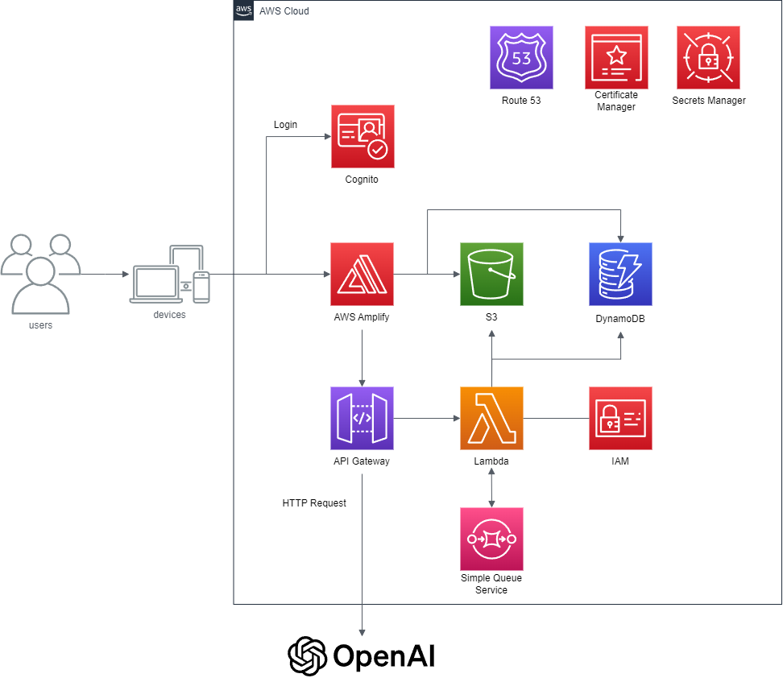
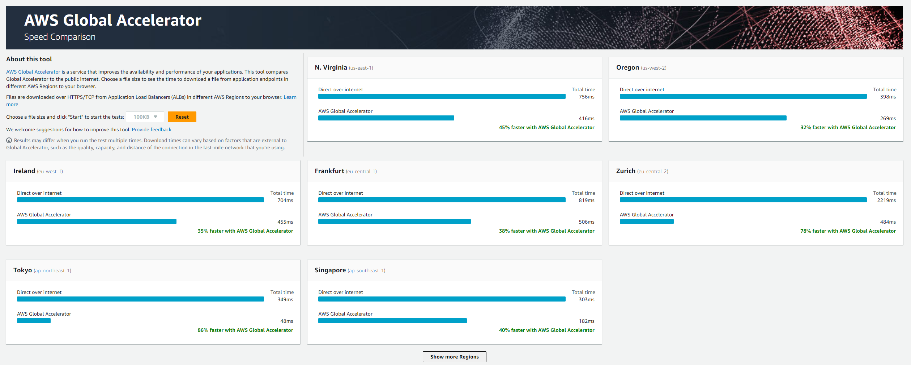

## niginigi-onigiri playground とは?

- 暇人の、暇人による、暇人のための WEB アプリ 🦖

## やってみたいこと

### 生成 AI アプリ

1. speech-to-text: On going
2. 複数人で共有する chat AI: future

### IoT

1. m5stack core2 for aws であそぶ: future
2. エアコン寒すぎるから制御したい: future
3. 位置情報使ってなんかしたい: future

### データ分析

1. 競馬予想: future

### 拡張現実

1. ポケモンとかいたら楽しそう: future

### web3

1. よくわかんないからとりあえず触ってみたい: future

## AWS 構成

### 生成 AI アプリ

1. speech-to-text
   

## レイテンシー

